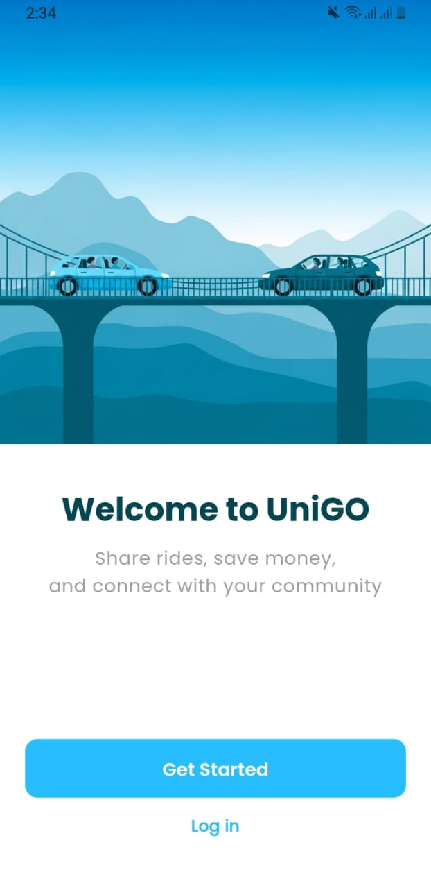
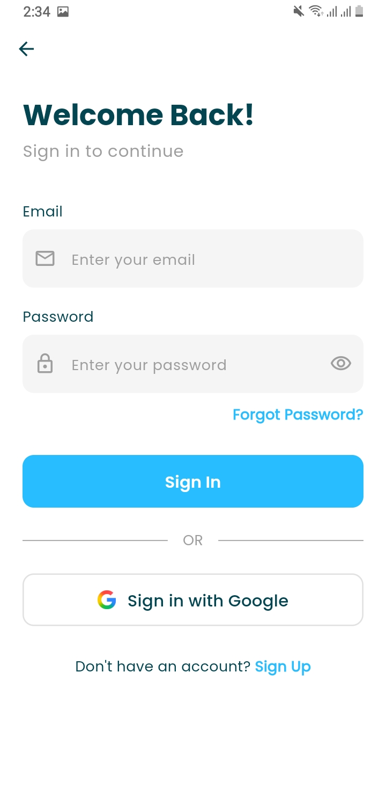
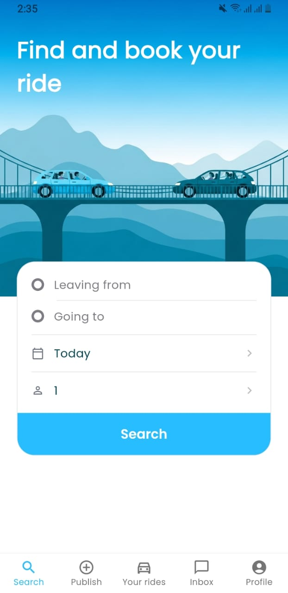
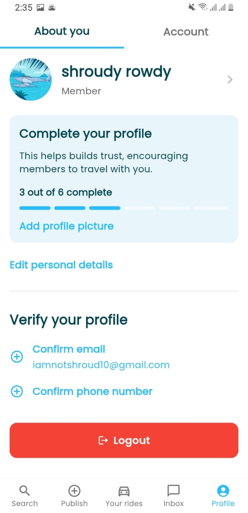
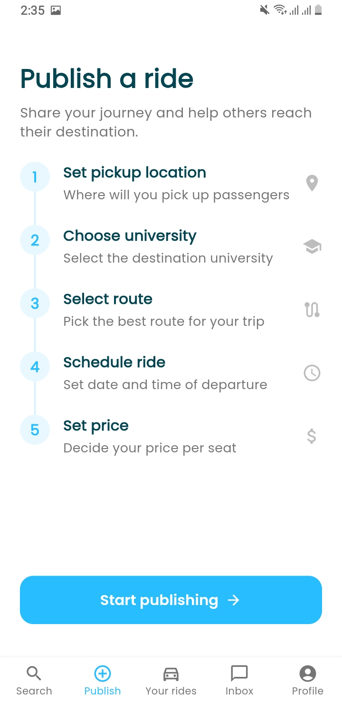

# UniGO - University Carpooling App

A modern carpooling application designed for university students to share rides to campus. UniGO connects drivers with passengers heading to the same university, making commuting more affordable and sustainable.

## App Preview

| Welcome Screen | Login | Signup |
|:---:|:---:|:---:|
|  |  |  |

| Search Results | Chat |
|:---:|:---:|
|  |  |

## Features

### For Drivers
- **Publish Rides** - Create ride listings with pickup location, destination, schedule, and pricing
- **Set Your Price** - Choose fare per seat based on distance and demand
- **Manage Requests** - Accept or reject ride requests from passengers
- **Track Passengers** - See who has booked your ride

### For Passengers
- **Search Rides** - Find available rides to your university by date and passenger count
- **Request Seats** - Send ride requests to drivers with your pickup location
- **Chat with Drivers** - Communicate directly through in-app messaging
- **Track Bookings** - View your upcoming rides and booking status

### App Highlights
- **Easy Onboarding** - Simple 5-step signup process
- **Interactive Maps** - Visual route planning with pickup/dropoff selection
- **Real-time Chat** - Instant messaging with typing indicators and read receipts
- **Smart Notifications** - Get alerted for ride requests, acceptances, and messages
- **User Profiles** - Build trust with verified profiles and photos

## How It Works

1. **Sign Up** - Create your account with email or Google
2. **Complete Profile** - Add your university, phone, and profile photo
3. **Publish a Ride** - Set your pickup point, destination, time, and price
   - OR
4. **Find a Ride** - Search for rides matching your route and schedule
5. **Connect** - Request a ride or accept passenger requests
6. **Chat & Coordinate** - Message each other to finalize details

## Available Universities

UniGO supports multiple universities. Select your university during signup to see rides heading to your campus.

## Privacy & Safety

- **Verified Profiles** - Users must verify email and phone
- **Secure Messaging** - All conversations happen within the app
- **Ride History** - Track your rides and bookings
- **Report Issues** - Easy reporting system for safety concerns

## Coming Soon

- In-app payments
- Rating system for drivers and passengers
- Recurring ride schedules
- More universities

## Download

Coming soon to App Store and Google Play

